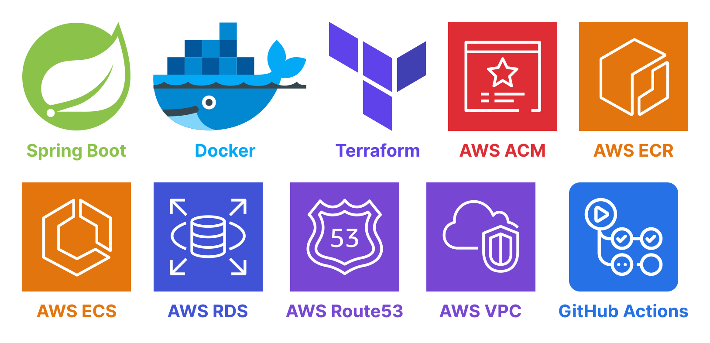

# Java Spring Boot + AWS ECS Fargate + DevOps

This repository demonstrates a real-world practical example of deploying a Java Spring Boot backend application to AWS
ECS Fargate.
This example is a simple full CRUD Notes application.

A GitHub CI/CD workflow has also been integrated so that on each push to this (`main`) branch, it will automatically
deploy the latest version of the backend Spring Boot application to AWS Fargate.

# 0. Technologies used

| Technology       | Version             |
|------------------|---------------------|
| Java Spring Boot | `v3.1.5`            |
| Docker           | `v24.0.6`           |
| Docker Compose   | `v2.22.0-desktop.2` |
| Terraform        | `v1.6.3`            |

# 1. What is an ECS Fargate?

- AWS Elastic Container Service (ECS) Fargate is a fully-managed container orchestration service that allows developers
	to deploy and manage containers without managing underlying EC2 instances.

## 1.1. When to use ECS Fargate?

- Deploying Java Spring Boot applications with ECS Fargate can be an excellent choice for organizations that want to
	**reduce infrastructure management overhead** and increase the scalability and reliability of their applications.
- When combined, Java Spring Boot and AWS ECS Fargate provide a powerful solution for deploying and managing Java
	applications in a containerized environment.
- By utilizing Java Spring Boot's ease of development and AWS ECS Fargate's simplicity of deployment, developers can
	build **scalable** and **highly available** applications that leverage the benefits of containerization.

# 2. Architecture

This repository models the following Cloud architecture all via Terraform.

